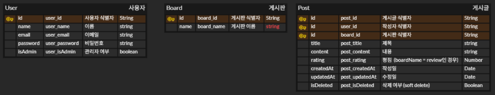

# 족발마을 웹 백엔드 (Jokbal Village Backend)

## 1️⃣ **프로젝트 개요**

- 프로젝트명: 족발마을 웹 (Jokbal Village)

- 목적: 모바일 중심 메뉴/매장/고객 리뷰 데이터를 관리하는 백엔드

- 기술 스택:

  - Node.js + Express

  - MongoDB Atlas

  - JWT 기반 인증

  - Bcrypt 패스워드 암호화

## 2️⃣ **데이터 모델**


## 3️⃣ **API 목록**

### 사용자(User)
| Method | Endpoint           | 설명 |
|--------|------------------|------|
| POST   | `/api/users/register` | 회원가입 |
| POST   | `/api/users/login`    | 로그인 (JWT 발급) |
| POST   | `/api/users/logout`   | 로그아웃 |
| GET    | `/api/users/profile`  | 본인 정보 조회 (JWT 필요) |
| DELETE    | `/api/users/delete`  | 회원 탈퇴 (JWT 필요) |

### 게시판(Board)
| Method | Endpoint           | 설명 |
|--------|------------------|------|
| GET    | `/api/boards`         | 게시판 목록 조회 |
| GET    | `/api/boards/:id`     | 게시판 상세 조회 |
| POST   | `/api/boards`         | 게시판 생성 (관리자만) |
| PUT    | `/api/boards/:id`     | 게시판 수정 (관리자만) |
| DELETE | `/api/boards/:id`     | 게시판 삭제 (관리자만) |

### 게시글(Post)
| Method | Endpoint               | 설명 |
|--------|----------------------|------|
| GET    | `/api/posts`          | 게시글/리뷰 목록 조회 |
| GET    | `/api/posts/:id`      | 게시글/리뷰 상세 조회 |
| GET    | `/api/posts/user/:id` | 내가 쓴 글 조회 (JWT 필요) |
| POST   | `/api/posts`          | 게시글/리뷰 작성 (JWT 필요) |
| PUT    | `/api/posts/:id`      | 게시글/리뷰 수정 (본인 작성만) |
| DELETE | `/api/posts/:id`      | 게시글/리뷰 삭제 (본인 작성만) |


## 4️⃣ **환경 변수 정의**
```bash
# .env
PORT=5000
DB_HOST=
DB_USER=
DB_PASSWORD=
DB_NAME=
JWT_SECRET=
```