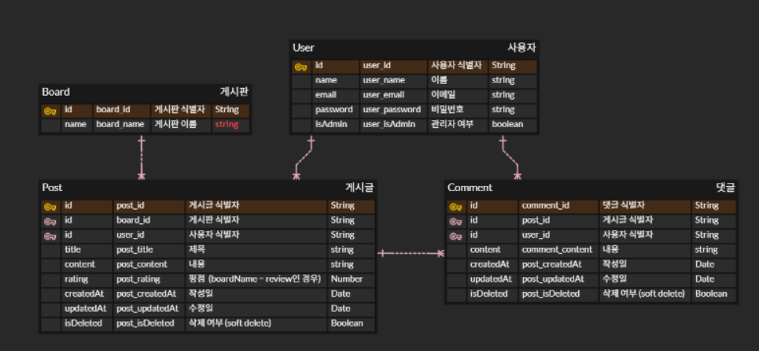

# 족발마을 웹 백엔드 (Jokbal Village Backend)

## 1️⃣ **프로젝트 개요**

- **프로젝트명:** 족발마을 웹 (Jokbal Village)
- **목적:**  
  모바일 중심의 메뉴, 매장, 고객 리뷰 데이터를 관리하는 백엔드 API 서버  
  JWT 인증 기반의 사용자 인증 및 관리자 승인 기능 포함
- **기술 스택:**
  - Node.js (TypeScript) + Express + Routing-controllers + TypeDI
  - MySQL (AWS RDS)
  - JWT (Access / Refresh 토큰)
  - Bcrypt (비밀번호 해시)
  - Class-validator (DTO 유효성 검증)
  - CORS + Cookie 기반 세션 유지

---

## 2️⃣ **데이터 모델**



---

## 3️⃣ **API 목록**

### 🔐 인증(Auth)

| Method | Endpoint             | 설명                                            |
| ------ | -------------------- | ----------------------------------------------- |
| POST   | `/api/auth/login`    | 로그인 → Access / Refresh 토큰 발급 (쿠키 저장) |
| POST   | `/api/auth/refresh`  | Access 토큰 재발급 (Refresh 쿠키 로테이션)      |
| POST   | `/api/auth/logout`   | 로그아웃 (Refresh 쿠키 및 DB 토큰 삭제)         |
| POST   | `/api/auth/register` | 회원가입                                        |

### 👤 사용자(User)

| Method | Endpoint         | 설명                      |
| ------ | ---------------- | ------------------------- |
| GET    | `/api/users/:id` | 특정 사용자 조회 (관리자) |
| GET    | `/api/users`     | 전체 사용자 조회 (관리자) |
| DELETE | `/api/users/:id` | 사용자 삭제 (관리자)      |

---

### 📋 게시판(Board)

| Method | Endpoint          | 설명                   |
| ------ | ----------------- | ---------------------- |
| GET    | `/api/boards`     | 게시판 목록 조회       |
| GET    | `/api/boards/:id` | 게시판 상세 조회       |
| POST   | `/api/boards`     | 게시판 생성 (관리자만) |
| PUT    | `/api/boards/:id` | 게시판 수정 (관리자만) |
| DELETE | `/api/boards/:id` | 게시판 삭제 (관리자만) |

---

### 📝 게시글(Post)

| Method | Endpoint              | 설명                           |
| ------ | --------------------- | ------------------------------ |
| GET    | `/api/posts`          | 게시글/리뷰 목록 조회          |
| GET    | `/api/posts/:id`      | 게시글/리뷰 상세 조회          |
| GET    | `/api/posts/user/:id` | 내가 쓴 글 조회 (JWT 필요)     |
| POST   | `/api/posts`          | 게시글/리뷰 작성 (JWT 필요)    |
| PUT    | `/api/posts/:id`      | 게시글/리뷰 수정 (본인 작성만) |
| DELETE | `/api/posts/:id`      | 게시글/리뷰 삭제 (본인 작성만) |

---

## 4️⃣ **환경 변수 정의**

```bash
# .env
NODE_ENV=development
PORT=5000

# DB 설정
DB_HOST=
DB_USER=
DB_PASSWORD=
DB_NAME=

# JWT 시크릿
JWT_SECRET=your-access-secret
JWT_REFRESH_SECRET=your-refresh-secret

# JWT 유효 시간
JWT_ACCESS_TTL=30m
JWT_REFRESH_TTL=7d

# CORS 설정
ALLOWED_ORIGIN=http://localhost:3000

# 관리자 계정 생성용
ADMINEMAIL=
ADMINPASSWORD=
```
